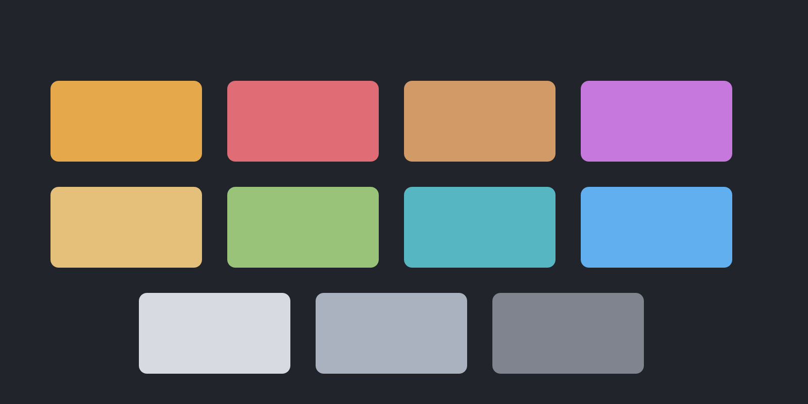
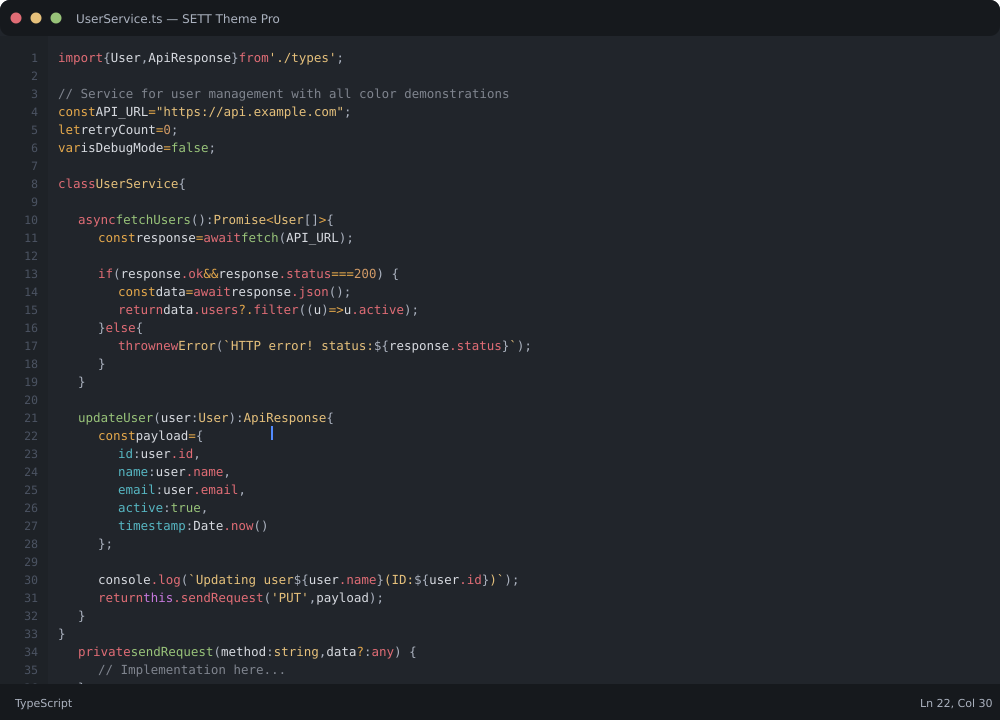

# ⚡ SETT Theme

**A powerful dark theme for VS Code with golden highlights**

**Golden highlights. Dark elegance. Built for developers.**

---

## ✨ Features

- **🔥 Golden Operators** - Storage keywords (`const`, `let`, `var`) and operators (`&&`, `>`, `=`) highlighted in striking golden
- **🎯 Smart Syntax** - Intelligent color hierarchy: keywords → properties → variables
- **👁️ High Contrast** - Bright white variables for maximum readability
- **⚡ Modern UI** - Clean interface with subtle golden accents
- **🌈 Rich Palette** - 11 carefully selected colors for perfect balance

---

## 🎨 Color Palette

---

## 📸 Preview

**Real TypeScript code with SETT Theme syntax highlighting**

---

## 🚀 Installation

1. Download `sett.vsix` from [releases](https://github.com/otaviozanon/sett-theme/releases)
2. Open VS Code
3. Press `Ctrl+Shift+P` (or `Cmd+Shift+P` on Mac)
4. Type "Install from VSIX"
5. Select the downloaded file
6. Reload VS Code
7. Press `Ctrl+K Ctrl+T` and select **SETT Dark Pro**

---

## 📄 License

MIT © SETT Theme
